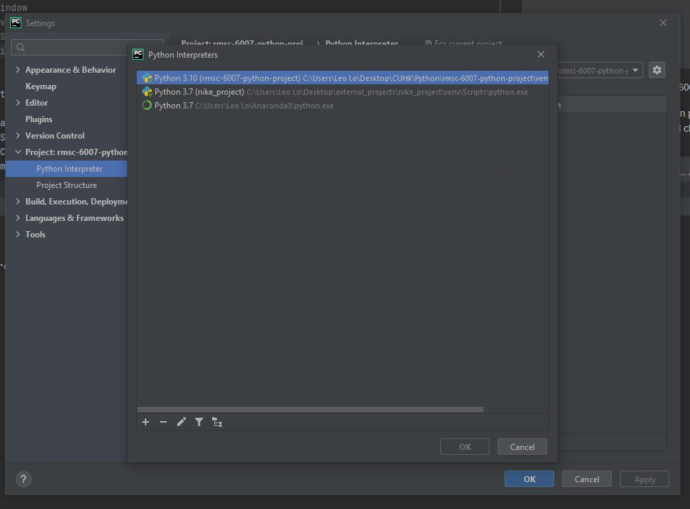
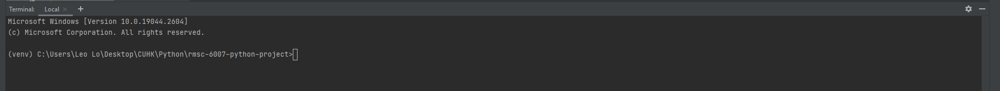

# Requirements
Python Version :  3.10 or above


Download Anaconda with python version 3.10
You can check it via anaconda Navigator

# Create Environment with Python 3.10.9

Go to Anaconda Prompt
```
conda create python=3.10.9 -n python-3.10.9
conda activate python-3.10.9
pip install virtualenv 
virtualenv venv
# Window user -> to check whether venv is exist in the folder
dir
# Mac or Linux user -> to check whether venv is exist in the folder
ls
```
Go to Pycharm Terminal
```sql
# Window
cd venv
cd Scripts
activate
```

Go to File -> Setting -> Project:rmsc-6007-python -> Python interpreter

1. add interpreter which we create in previous step
2. Select the correct interpreter and click ok 
3. Click Apply and ok


   
Reopen the terminal in bottom of Pycharm, you should be able to see the venv next to the directory



Input the following command 

```
pip install -r requirements.txt
```

# Start Streamlit app in local

```angular2html
streamlit run src/streamlit_app/my_app.py
```